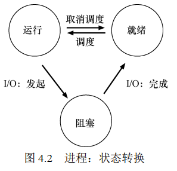

# 抽象
## 4.2 进程API
对于进程，所有现代操作系统都会提供以下API:  
- 创建（create）
- 销毁（destory）：例如linux的kill
- 等待（wait）：等待进程停止运行
- 其他控制：暂停进程，然后恢复
- 状态：获取进程的状态，运行时间等信息
## 4.3 创建进程
## 4.4 进程API
简而言之，进程可以处于以下3种状态：
1. 运行（running）
2. 就绪（ready）：进程已准备好运行，由于某种原因，操作系统选择不在此时运行。
3. 阻塞（blocked）：被IO阻塞，例如发起磁盘请求时。  
如图4.2所示，操作系统决定进程在就绪和运行间切换  
  
进程从就绪状态切换到运行状态，意味着进程被scheduled。  
进程从运行状态切换到就绪状态，意味着进程被descheduled。  